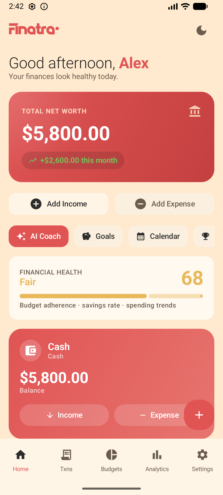
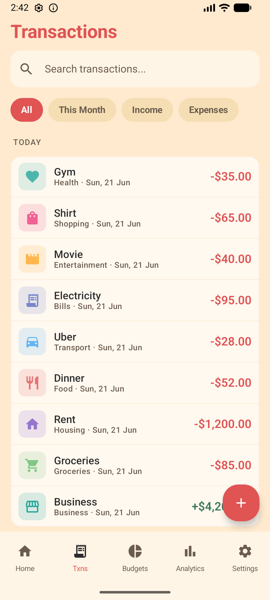
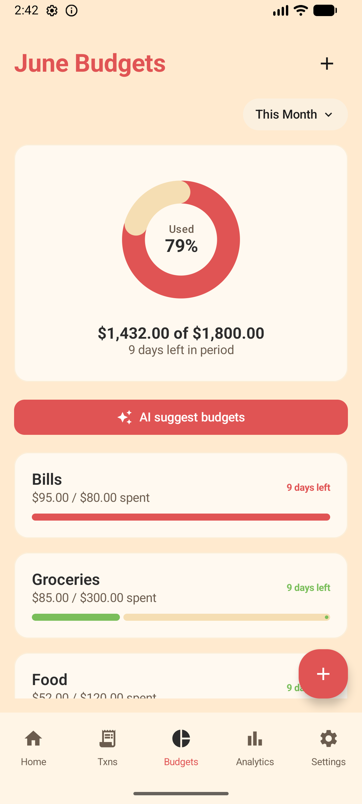
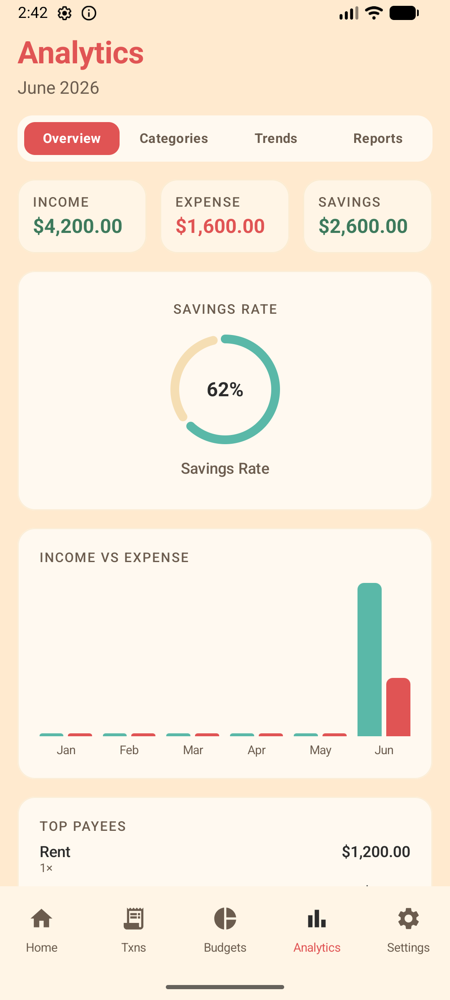
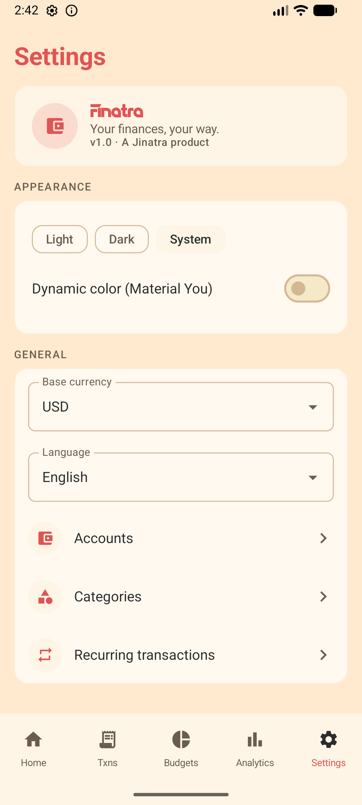

# Finatra

**Your finances, your way.**

Finatra is a **privacy-first, offline personal finance manager** for Android, built under the **Jinatra** brand. Track income, expenses, budgets, accounts, and net worth — with **all data stored locally on your device**. No cloud sync, no bank logins, no telemetry.

Optional AI features (spending insights, natural-language entry, smart categorization, budget recommendations) run either via **your own cloud API key** or **fully on-device** using a Gemma model — your choice, your data.

---

## Screenshots

| Home | Transactions | Budgets |
|---|---|---|
|  |  |  |

| Analytics | Settings |
|---|---|
|  |  |

---

## Features

- **Accounts** — Cash, Bank, Credit Card, Mobile Wallet, Crypto, Trading/Brokerage, Investment/Savings. Per-account color & icon, transfers between accounts.
- **Transactions** — income / expense / transfer; category, account, notes, tags, **receipt photo**, and **split across categories**; swipe to delete; search & filter; reusable **templates**; per-transaction **audit log**.
- **Recurring transactions** — schedule repeating income/expenses (daily, weekly, monthly, or custom) that post automatically in the background.
- **Account carousel** — swipe between account cards on the dashboard; each shows balance and quick **Income / Expense** actions, with a per-account spending chart that adapts to the account's color.
- **Budgets** — monthly or custom-period limits per category, traffic-light progress bars (safe / warning / over), a usage donut, a 30-day balance forecast, and a conversational **AI budget planner** that proposes limits from your spending history.
- **Analytics** — savings-rate donut, category breakdown, income-vs-expense bars, net-worth-over-time trend, top payees, a "what-if" projection, and a multi-month report summary.
- **Goals** — savings goals with progress tracking and an AI "can I afford it?" check.
- **AI Coach** — an on-device/cloud chat assistant that answers questions about your finances.
- **Calendar** — a month view of income and spending day by day.
- **Achievements** — streaks, badges, and challenges that reward consistent tracking.
- **Multi-currency** — per-account currency with manual exchange rates; dashboard totals converted to your base currency.
- **AI (optional)** — natural-language entry ("spent 540 on lunch"), smart categorization, dashboard insights, budget planning, goal advice, and the AI Coach. Works with **Gemini / Claude / OpenRouter** (your API key) or **fully on-device Gemma** (MediaPipe LLM Inference). A built-in basic parser handles quick-add even with no AI key.
- **Onboarding** — a guided first-run setup plus an optional quick quiz that tailors the experience to your money style.
- **Notifications** — budget overspend alerts, recurring reminders, low-balance warnings, and weekly / monthly summaries (each toggleable).
- **Security** — PIN & biometric app lock, configurable auto-lock, an optional **decoy PIN**, and screenshot prevention (`FLAG_SECURE`). Sensitive values stored in `EncryptedSharedPreferences`.
- **Data portability** — export CSV, import CSV, full JSON backup & restore. Everything stays on the device.
- **Home-screen widget** — a Glance balance widget showing net worth and budget progress at a glance.
- **Material 3 Expressive** design with light & dark themes derived from the Jinatra logo, plus optional Material You dynamic color, and English / Bengali (বাংলা) localization.

---

## Tech stack

| Layer | Technology |
|---|---|
| Language | Kotlin |
| UI | Jetpack Compose · Material 3 |
| Architecture | MVVM · Hilt (DI) · Kotlin Coroutines/Flow |
| Local data | Room (SQLite) · DataStore · EncryptedSharedPreferences |
| Background | WorkManager |
| Widget | Glance |
| Networking (optional AI) | OkHttp |
| On-device AI (optional) | MediaPipe Tasks GenAI (Gemma) |
| Images | Coil |
| Min SDK | 26 (Android 8.0) · Target 35 |

---

## Building

Requires **JDK 17+** (the Android Studio bundled JBR works well).

```bash
# Debug APK
./gradlew assembleDebug
# Output: app/build/outputs/apk/debug/app-debug.apk

# Unit tests
./gradlew testDebugUnitTest

# Instrumented tests (needs a device/emulator)
./gradlew connectedDebugAndroidTest
```

Open the project in Android Studio and run the `app` configuration on a device or emulator (API 26+).

### Optional AI setup
- **Cloud:** Settings → AI → choose a provider and paste your API key (stored encrypted on-device).
- **On-device:** Settings → AI → import or download a Gemma `.task` model. License-gated models require an access token.

---

## Privacy & Terms

Finatra keeps your financial data **on your device**. See:

- [Privacy Policy](PRIVACY.md)
- [Terms & Conditions](TERMS.md)

---

## Project status

Active development. Core features are implemented and the app builds and runs on Android 8.0+. On-device Gemma inference requires a user-supplied model file. The included Privacy and Terms documents are **templates** and not legal advice.

---

*Finatra is a Jinatra product. Built with care. © 2026 Jinatra.*
